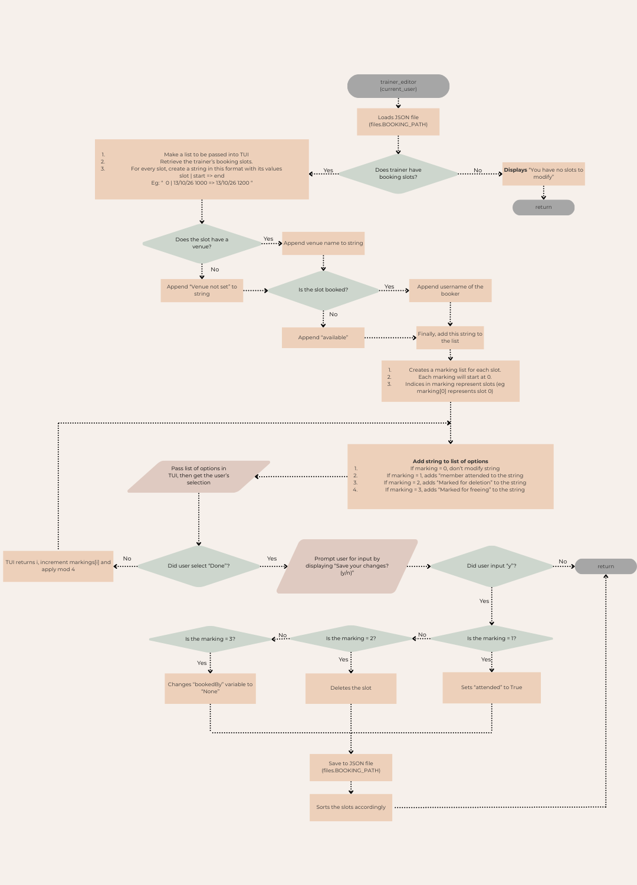
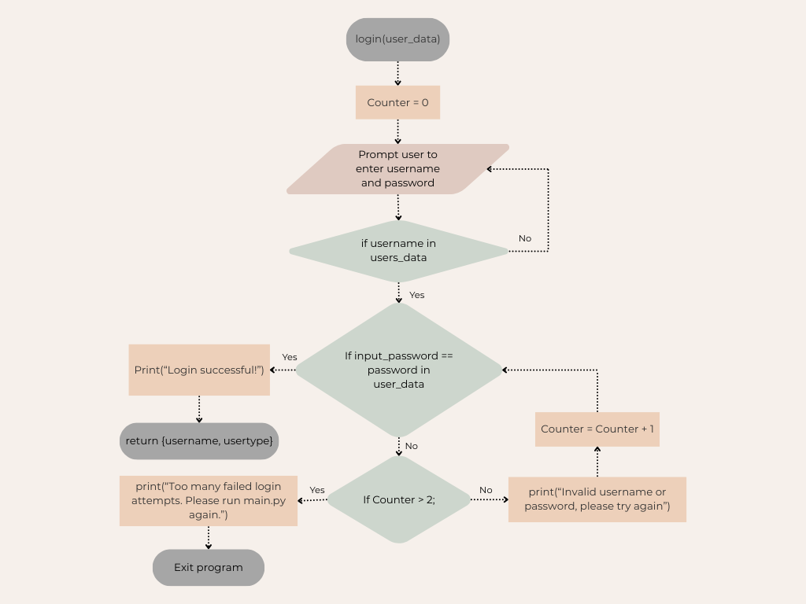
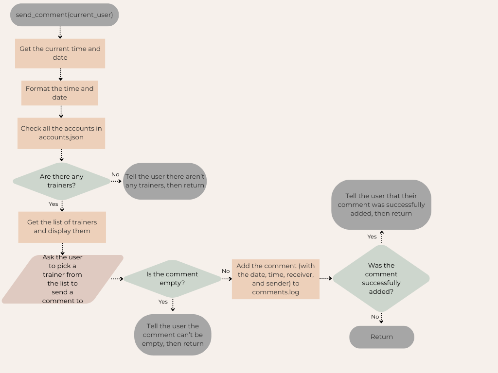
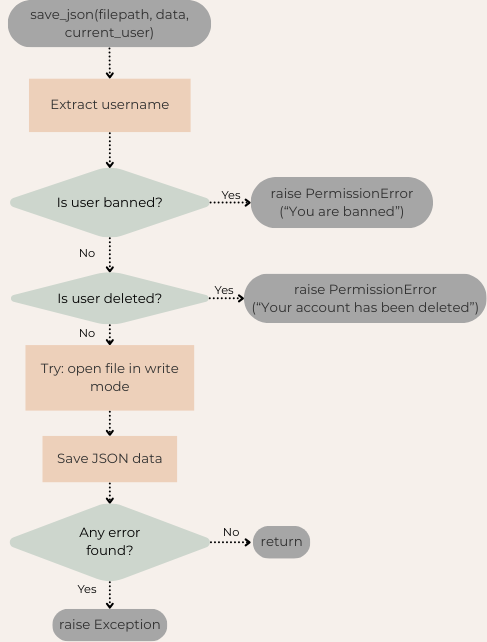

Demystifying each file
======================
This section will fully explain (if not trivial) each file in the project. The subsections represent folders, and the sub-subsections represents the files itself.

logs
----
The logs folder holds .log files than contain user history. Potential debugging, or finding culprits to certain problems. The .log suffix is completely arbitrary and can be parsed or formatted in any way. 

accounts.log
~~~~~~~~~~~~
Contains account creation, login, and other account-related events.

.. code-block:: text
    :caption: accounts.log
    :linenos:
    

    28/12/25 21:13 ACCOUNT: member BANNED BY: admin
    28/12/25 21:14 ACCOUNT: member UNBANNED BY: admin
    28/12/25 21:15 member BOUGHT MEMBERSHIP Premium
    28/12/25 21:17 member BOUGHT MEMBERSHIP Student
    28/12/25 21:22 member BOUGHT MEMBERSHIP Standard
    28/12/25 21:23 member BOUGHT MEMBERSHIP Premium
    28/12/25 22:19 member BOUGHT MEMBERSHIP Premium
    28/12/25 23:10 pcb BOUGHT MEMBERSHIP Premium
    29/12/25 00:02 member BOUGHT MEMBERSHIP Student
    29/12/25 00:08 member UPGRADED MEMBERSHIP Student TO PREMIUM
    04/01/26 16:42 ACCOUNT: labubu CREATED BY: pcb
    04/01/26 16:43 ACCOUNT: labubu UPDATED BY: pcb TO: labubu

comments.log
~~~~~~~~~~~~
Feedback from members to trainers 

``DD/MM/YY|HH:MM|member|trainer|message``

.. code-block:: text
    :caption: comments.log
    :linenos:
    

    11/11/14|12:55|pcb|trainer_user|but steel is heavier than feathers..
    11/11/25|15:44|pcb|trainer_user|comment 2
    11/11/25|15:44|pcb|trainer_user|ble
    11/11/25|15:44|pcb|trainer_user|aishdioashid
    11/11/25|15:44|pcb|trainer_user|please come on time
    27/12/25|20:22|jjjj|epstein|where the kids at?
    28/12/25|18:14|pcb|epstein|BOO
    28/12/25|18:15|pcb|epstein|2
    28/12/25|18:18|pcb|epstein|test
    28/12/25|18:19|pcb|epstein|test

transactions.log
~~~~~~~~~~~~~~~~
How much money goes into buying memberships

.. code-block:: text
    :caption: transactions.log
    :linenos:
    
    # epoch username amount
    0 pocong 0
    1766928208.3506627 member 250
    1766931579.3983493 member 250
    1766934637.2874255 pcb 250
    1766937726.9389875 member 100
    1766938108.2459538 member 110

userData
--------
Persistent user data. Any changes made here will be reflected in the system

accounts.json
~~~~~~~~~~~~~
accounts.json contains two main objects, ``permissions`` and ``users``. ``permissions`` is subject to configuration by admins.

See: :ref:`config` 

.. code-block:: json
    :caption: first part of accounts.json
    :linenos:
    

    {
    "permissions": {
        "debug": [
            "debug"
        ],
        "admin": [
            "manage_staff",
            "admin",
            "admin_bookings"
        ],
        "Member": [
            "send_comments",
            "profile",
            "member_bookings",
            "membership",
            "my_transactions"
        ],
        "Trainer": [
            "send_comments",
            "view_comments",
            "trainer_bookings"
        ],
        "Front Desk": [
            "manage_members",
            "attendance"
        ],
        "Finance Manager": [
            "transactions"
        ]
    },
    "users": {
        "admin": {
            "password": "admin",
            "email": "admin@example.com",
            "user_type": "admin",
            "uuid": "f2e3f8da-6fd0-4e5a-9e90-8f0f8f5f1e21",
            "age": 0,
            "gender": null,
            "phone number": null,
            "balance - RM": 0,
            "membership_tier": null
        },

    

bookings.json
~~~~~~~~~~~~~
Contains a key for each trainer. Which contains slot numbers, and slot numbers contains start time and end time.

.. code-block:: json
    :linenos:
    :caption: first part of bookings.json

    {
        "trainer_user": {
            "0": {
                "start": 1735660800,
                "end": 1735664400,
                "bookedBy": null,
                "venue": null,
                "Attended": false
            },
            "1": {
                "start": 1765879200,
                "end": 1765882800,
                "bookedBy": "boo",
                "venue": null,
                "Attended": true
            },
            "2": {
                "start": 1765886400,
                "end": 1765889600,
                "bookedBy": "pcb",
                "venue": null,
                "Attended": true
            },
            "3": {
                "start": 1765896600,
                "end": 1765900200,
                "bookedBy": "pcb",
                "venue": null,
                "Attended": true
            }
        },
        "epstein": {
            "0": {
                "start": 820410600.0,
                "end": 820417800.0,
                "bookedBy": "jianjun",
                "venue": "epstein island",
                "Attended": true
            },
            "1": {
                "start": 1766448000,
                "end": 1766451600,
                "bookedBy": "jianjun",
                "venue": "G-0-1",
                "Attended": false
            },

...

expiry.json
~~~~~~~~~~~
When a user buys or upgrades a membership, their username will be added here as a key, with the value being 30 days after they bought the membership. (In UNIX timestamp)

.. code-block:: json
    :caption: expiry.json
    :linenos:
    
    {
        "member": 1769529726.938576,
        "pcb": 1769526637.2867684
    }

concurrent
----------
This folder contains files that are involved in mutli-instance edge cases

delete
~~~~~~
Users who are still online but are marked for deletion. This should be completely empty when resolved

online
~~~~~~
Users who are online. This should be completely empty when no users are online. It's possible that a user might encounter an unhandled exception and not be removed from this file.

.. _python-file-explanations:

In the project folder itself
----------------------------

banned
~~~~~~
Users who are banned

booking.py
~~~~~~~~~~
.. code-block:: python
    :caption: imports for bookings.py
    :linenos:
    
    import json 
    from tui import TUI, timeTUI # local library
    import time 
    from datetime import datetime 
    from utils import * # local library
    from colors import * #local library
    import files
   
    
.. autofunction:: booking.sort_slots

.. code-block:: python
    :lineno-start: 17
    
    bookings = load_json(files.BOOKING_PATH)
    slots = []
    for slot in bookings[trainer]:
        slots.append(bookings[trainer][slot])
    slots.sort(key=lambda x: x["start"]) # sort with regards to start time

    bookings[trainer] = {} # clear slots

    for i in range(len(slots)): 
        bookings[trainer][str(i)] = slots[i] # insert slots back into bookings
    current_user = { "username": trainer, "user_type": "Trainer" } 
    save_json(files.BOOKING_PATH, bookings, current_user) # save changes

.. autofunction:: booking.generate_next_7_days

.. code-block:: python
    :lineno-start: 37

    
    # generates 7 days ahead, with 4 slots in each day
    bookings = load_json(files.BOOKING_PATH)
    trainer = current_user["username"]
    if trainer not in bookings:
        raise KeyError(f"{trainer} not found in bookings")
    
    now = datetime.now()
    timestamp = int(datetime(now.year, now.month, now.day).timestamp()) # start of today

    hours = [8, 10, 14, 16] # 8am, 10am, 2pm, 4pm
    for i in range(7):
        for j in range(4):
            start = timestamp + (i * 24 * 60 * 60) + (hours[j] * 60 * 60) 
            end = start + 60 * 60                                          # 1 hour after
            if conflict(trainer, start) or conflict(trainer, end):         # if start or end time is between existing time range
                continue
            add_slots_epoch(current_user, start, end)
    print(GREEN + "Generated time slots for next 7 days" + RESET)

.. autofunction:: booking.add_slots

.. code-block:: python
    :lineno-start: 58

    
    bookings = load_json(files.BOOKING_PATH)
    trainer = current_user["username"]
    start = int(datetime(year, month, day, hour, minute).timestamp()) # not time.time() because args
    end = start + 60 * 60                                             # an hour after
    
    start = timeTUI(prompt="start", timestamp=start, username=trainer)
    if start is None:
        return
    end = timeTUI(prompt="end", timestamp=end, username=trainer)
    if end is None:
        return

    slots = bookings[trainer].keys()
    max_slot = max([int(slot) for slot in slots]) if slots else 0       # get max slot number
    bookings[trainer][max_slot + 1] = {
        "start": start,
        "end": end,
        "bookedBy": None,
        "venue": None,
        "Attended": False
    }
    save_json(files.BOOKING_PATH, bookings, current_user)
    print("Added time slot to bookings")
    sort_slots(trainer)

.. autofunction:: booking.trainer_editor

.. code-block:: python
    :lineno-start: 99

    
    bookings = load_json(files.BOOKING_PATH)
    trainer = current_user["username"]

    if trainer not in bookings or not bookings[trainer]:
        raise KeyError("You have no slots to modify")
    slots = bookings[trainer]

    strings = []
    for slot in slots:
        start       = epoch_to_readable(slots[slot]["start"])
        end         = epoch_to_readable(slots[slot]["end"])
        bookedBy    = slots[slot]["bookedBy"]
        venue       = slots[slot]["venue"]

        string = f"{slot} | {start} => {end}"

        if venue is None:
            string += f"{RESET} {BG_RED}{DARK_GRAY}(Venue not set){RESET}"
        else:
            string += f"{RESET} {BG_BLUE}{DARK_GRAY}(Venue: {venue}){RESET}"
        
        if bookedBy is None:
            string += f"{RESET} {BG_GREEN}{DARK_GRAY}(Available){RESET}"
        else:
            string += f"{RESET} {BG_BLUE}{DARK_GRAY}(Booked by {bookedBy}){RESET}"

        strings.append(string)

    markings = [0] * len(slots) 
    idx = 0
    while True: 
        options = []
        options.append(BLUE + "Done" + RESET)
        for i in range(len(strings)):
            if markings[i] == 0:
                options.append(strings[i])
            if markings[i] == 1:
                options.append(strings[i] + " " + BG_PURPLE + "Member attended" + RESET)
            if markings[i] == 2:
                options.append(strings[i] + " " + BG_RED + DARK_GRAY + "Marked for deletion" + RESET)
            if markings[i] == 3:
                options.append(strings[i] + " " + BG_GREEN + DARK_GRAY + "Marked for freeing" + RESET)
            
        selection = TUI(BG_PURPLE, "Select slot", options, verbose=False, idx=idx)
        idx = selection
        if selection is None:
            return
        if selection == 0:
            break
        selection -= 1 # offset for back

        markings[selection] = (markings[selection] + 1) % 4 # cycle through 0, 1, 2, 3
    
    confirm = input("Save your changes? (y/n): ")
    if confirm == "y":
        for i in range(len(markings)):
            if markings[i] == 1:
                bookings[trainer][str(i)]["Attended"] = True
            if markings[i] == 2:
                del bookings[trainer][str(i)]
            if markings[i] == 3:
                bookings[trainer][str(i)]["bookedBy"] = None

        save_json(files.BOOKING_PATH, bookings, current_user)
        sort_slots(trainer) # yes, i have to sort it after saving
    else:
        return

.. autofunction:: booking.add_slots_epoch

.. code-block:: python
    :lineno-start: 174

    
    bookings = load_json(files.BOOKING_PATH)
    trainer = current_user["username"]
    slots = bookings[trainer].keys()
    max_slot = max([int(slot) for slot in slots]) if slots else 0
    bookings[trainer][max_slot + 1] = {
        "start":    start,
        "end":      end,
        "bookedBy": None,
        "venue":    None,
        "Attended": False
    }
    save_json(files.BOOKING_PATH, bookings, current_user)
    sort_slots(trainer)

.. autofunction:: booking.attendance

.. code-block:: python
    :lineno-start: 207

    bookings = load_json(files.BOOKING_PATH)
    user_data = load_json(files.ACCOUNTS_PATH)
    users = user_data["users"]
    trainers = []
    for user in users:
        if users[user]["user_type"] == "Trainer":
            trainers.append(user)
    
    trainer = TUI(BG_MAGENTA, "Select trainer", trainers, verbose=True)
    if trainer is None:
        return

    slots = bookings[trainer]

    strings = []
    markings = [0] * len(slots)
    for slot in slots:
        start = epoch_to_readable(slots[slot]["start"])
        end = epoch_to_readable(slots[slot]["end"])
        bookedBy = slots[slot]["bookedBy"]
        venue = slots[slot]["venue"]
        attended = slots[slot]["Attended"]

        string = f"{slot} | {start} => {end}"

        if venue is None:
            string += f"{RESET} {BG_RED}{DARK_GRAY}(Venue not set){RESET}"
        else:
            string += f"{RESET} {BG_BLUE}{DARK_GRAY}(Venue: {venue}){RESET}"
        
        if bookedBy is None:
            string += f"{RESET} {BG_GREEN}{DARK_GRAY}(Available){RESET}"
        else:
            string += f"{RESET} {BG_BLUE}{DARK_GRAY}(Booked by {bookedBy}){RESET}"

        if attended:
            markings[int(slot)] = 1
        strings.append(string)

    idx = 0
    while True:
        options = []
        options.append(BLUE + "Done" + RESET)
        for i in range(len(strings)):
            if markings[i] == 0:
                options.append(strings[i] + " " + BG_RED + "Member absent" + RESET)
            if markings[i] == 1:
                options.append(strings[i] + " " + BG_PURPLE + "Member attended" + RESET)
        selection = TUI(BG_PURPLE, "Select slot", options, verbose=False, idx=idx)
        idx = selection
        if selection is None:
            return
        if selection == 0:
            break
        selection -= 1 # offset for back

        markings[selection] = (markings[selection] + 1) % 2 # cycle through 0, 1
    
    confirm = input("Save your changes? (y/n): ")
    if confirm == "y":
        for i in range(len(markings)):
            if markings[i] == 1:
                bookings[trainer][str(i)]["Attended"] = True
            else:
                bookings[trainer][str(i)]["Attended"] = False
        save_json(files.BOOKING_PATH, bookings, current_user)
    else:
        return

.. autofunction:: booking.venue

.. code-block:: python
    :lineno-start: 283

    bookings = load_json(files.BOOKING_PATH)
    user_data = load_json(files.ACCOUNTS_PATH)
    users = user_data["users"]
    trainers = []
    
    for user in users:
        if users[user]["user_type"] == "Trainer":
            trainers.append(user)
    
    trainer = TUI(BG_MAGENTA, "Select trainer", trainers, verbose=True)
    if trainer is None:
        return
    
    slots = bookings[trainer]
    markings = [None] * len(slots)
    strings = []
    for slot in slots:
        string = ""
        start = epoch_to_readable(slots[slot]["start"])
        end   = epoch_to_readable(slots[slot]["end"])
        string += f"{slot} | {start} => {end}"
        
        if slots[slot]["venue"] is None:
            string += f"{RESET} {BG_RED}No venue{RESET}"
        else:
            string += f"{RESET} {BG_BLUE}Venue: {slots[slot]["venue"]}{RESET}"

        if slots[slot]["bookedBy"] is None:
            string += f"{RESET} {BG_GREEN}Available{RESET}"
        else:
            string += f"{RESET} {BG_BLUE}Booked by: {slots[slot]["bookedBy"]}{RESET}"

        strings.append(string)

    idx = 0
    while True:
        options = []
        for i in range(len(markings)):
            if markings[i] is None:
                options.append(strings[i])
            else:
                options.append(strings[i] + " " + BG_BLUE + "Change to venue: " + markings[i] + RESET)
        options.insert(0, RED + "Done" + RESET)
        
        selection = TUI(BG_PURPLE, "Assign venues", options, verbose=False, idx=idx)
        if selection is None:
            return
        if selection == 0:
            break
        idx = selection
        selection -= 1

        try:
            venue = input(f"Enter venue for slot {selection}: ")
            if venue == "":
                venue = None 
            
            markings[selection] = venue
        except KeyboardInterrupt:
            print("\nCancelled")
            continue
    
    confirm = input("Save changes? (y/n): ")
    if confirm == "y":
        for i in range(len(markings)):
            if markings[i] is not None:
                bookings[trainer][str(i)]["venue"] = markings[i]
        save_json(files.BOOKING_PATH, bookings, current_user)

.. autofunction:: booking.member_frontend

.. code-block:: python
    :lineno-start: 354

    bookings = load_json(files.BOOKING_PATH)
    user_data = load_json(files.ACCOUNTS_PATH)
    users = user_data["users"]
    trainers = []

    for user in users:
        if users[user]["user_type"] == "Trainer":
            trainers.append(user)

    while True:
        trainer = TUI(BG_MAGENTA, "Select trainer", trainers, verbose=True)
        if trainer is None:
            return

        if trainer not in bookings or not bookings[trainer]:
            print(f"{RED}Trainer {trainer} does not have any slots.{RESET}")
            time.sleep(1)
            continue
        
        idx = 0
        while True:
            slots = []
            for slot in bookings[trainer]:
                
                bookedBy = bookings[trainer][slot]["bookedBy"]
                start = epoch_to_readable(bookings[trainer][slot]["start"])
                end = epoch_to_readable(bookings[trainer][slot]["end"])

                string = f"{slot} | {start} => {end}"
                
                if bookedBy is None:
                    string += f"{RESET} {BG_GREEN}(Available){RESET}"
                
                if bookedBy is not None:
                    string += f"{RESET} {BG_RED}(Booked){RESET}"

                if bookedBy == current_user["username"]:
                    string += f"{RESET} {BG_BLUE}(Booked by you){RESET}"
                    string += f"{RESET} {BG_BLUE}(Venue: {bookings[trainer][slot]["venue"]}){RESET}"
                
                slots.append(string)
            
            slots.insert(0, RED + "Back" + RESET)
            selection = TUI(BG_PURPLE, f"Slots for {trainer}", slots, verbose=False, idx=idx)
            idx = selection

            if selection == 0 or selection is None: # back or Ctrl+C
                break
            selection -= 1 # offset for back
            selection = str(selection)

            bookedBy = bookings[trainer][selection]["bookedBy"]
            if bookedBy is not None:
                if bookedBy == current_user["username"]:
                    print(RED + "Free booking? (y/n)" + RESET)
                    if input() == "y":
                        bookings[trainer][selection]["bookedBy"] = None
                        save_json(files.BOOKING_PATH, bookings, current_user)
                    continue
                else:
                    continue
            
            print(f"Book slot {selection}? (y/n)")
            if input() == "y":
                bookings[trainer][selection]["bookedBy"] = current_user["username"]
                save_json(files.BOOKING_PATH, bookings, current_user)
            else:
                continue        

colors.py
~~~~~~~~~
ANSI color constants. Compatible with all OS!

.. code-block:: python
    :lineno-start: 2
    :caption: Foreground colors
    
    RED = '\033[31m'
    GREEN = '\033[32m'
    YELLOW = '\033[33m'
    BLUE = '\033[34m'
    MAGENTA = '\033[35m'
    CYAN = '\033[36m'
    WHITE = '\033[37m'
    LIGHT_GRAY = '\033[38;5;244m'
    DARK_GRAY = '\033[38;5;240m'
    ORANGE = '\033[38;5;202m'
    GOLD = '\033[38;5;220m'
    PURPLE = '\033[38;5;93m'
    PINK = '\033[38;5;205m'
    BOLD = '\033[1m'
    RESET = '\033[0m'

.. code-block:: python
    :lineno-start: 19
    :caption: Background colors
    
    BG_BLACK = '\033[40m'
    BG_RED = '\033[41m'
    BG_GREEN = '\033[42m'
    BG_YELLOW = '\033[43m'
    BG_BLUE = '\033[44m'
    BG_MAGENTA = '\033[45m'
    BG_CYAN = '\033[46m'
    BG_WHITE = '\033[47m'
    BG_LIGHT_GRAY = '\033[48;5;244m'
    BG_DARK_GRAY = '\033[48;5;240m'
    BG_ORANGE = '\033[48;5;202m'
    BG_GOLD = '\033[48;5;220m'
    BG_PURPLE = '\033[48;5;93m'
    BG_PINK = '\033[48;5;205m'

.. code-block:: python 
    :caption: example usage
    
    from colors import *
    print(RED + "This is red text" + RESET)

main.py
~~~~~~~
This is the file you run, and where users can register, login, and use the CLI to run commands. ``cmdlist`` is to be changed and configured by admins.

.. code-block:: python
    :caption: imports
    :lineno-start: 1

    #internal libraries
    import getpass
    import re
    import time
    import uuid
    import inspect

    #local project libraries
    import commands
    from utils import *

    from tui import TUI
    from colors import *
    import files
    import booking
    import membership
    #globals
    current_user = {}

.. code-block:: python
    :caption: Part of the permission structure
    :lineno-start: 44

    cmdlist = {}    # This is for commands with arguments.
                    # The permission object in accounts.json contains user types, and user types contains the permissions
    cmdlist["manage_staff"] = {
        "delete":   commands.admin_delete_account,
        "add":      commands.admin_add_account,
        "edit":     commands.admin_edit_account,
        "view":     commands.admin_view_account
    }
    cmdlist["manage_members"] = {
        "delete":   commands.fd_delete_account,
        "add":      commands.fd_add_account,
        "edit":     commands.fd_edit_account,
        "topup":    membership.fd_top_up
    }
    ...

.. code-block:: python
    :caption: if main.py is run directly, call main()
    :lineno-start: 476

    if __name__ == "__main__":
        main()

.. autofunction:: main.safe_call

.. code-block:: python
    :lineno-start: 35

    try:
        return func(*args, **kwargs)
    except KeyboardInterrupt:
        print("\nReceived keyboard interrupt")
        return None
    except Exception as e:
        print(RED + f"Error: {e}" + RESET) # Will catch TypeErrors, e.g. too many arguments or wrong data types
        return None

.. autofunction:: main.online

.. code-block:: python

    global current_user
    write_line(current_user["username"], files.ONLINE_PATH)

.. autofunction:: main.offline

.. code-block:: python
    :lineno-start: 118
    
    global current_user
    count = 0
    with open(files.ONLINE_PATH, "r") as f:
        online_users = f.read().splitlines()

    with open(files.ONLINE_PATH, "w") as f:
        for user in online_users:
            if user == '':
                continue
            if user != current_user["username"]:
               f.write("\n" + user)
            else:
                count += 1
                if count > 1:
                    f.write("\n" + user) # do not overwrite instances of the same user

.. autofunction:: main.who

.. code-block:: python
    :lineno-start: 140

    with open(files.ONLINE_PATH, "r") as f:
        print(f.read().splitlines())

.. autofunction:: main.login

.. code-block:: python
    :lineno-start: 150

    commands.clear()
    try:
        for _ in range(3):
            username = input("Username: ")
            password = getpass.getpass("Password: ") #getpass.getpass() hides password
            time.sleep(0.2) #just to make it hard to bruteforce

            if username in users:
                if users[username]["password"] == password: #will crash if I put both in AND
                    print(GREEN + "Welcome to Fitness Center!" + RESET)
                    return {"username": username, "user_type": users[username]["user_type"]}

            print(RED + "Username does not exist or password is incorrect. Please try again" + RESET)

            # Log failed login attempt
            import datetime
            timestamp = datetime.datetime.now().strftime("%d/%m/%y %H:%M:%S")
            log_entry = f"{timestamp} FAILED LOGIN ATTEMPT: {username}"
            write_line(log_entry, files.ACCOUNTS_LOG_PATH)
    except KeyboardInterrupt:
        print("Keyboard interrupt. Exiting...")
        exit(0)

    print(RED + "You have exceeded three attempts, please run the program again" + RESET)
    exit(0)

.. autofunction:: main.register

.. code-block:: python
    :lineno-start: 184
    
    commands.clear()

    try:
        while True:
            username = input("Username: ")
            time.sleep(1) #just to make it hard to bruteforce

            if username in user_data["users"]:
                print(RED + "Sorry, this username has been taken" + RESET)
            else:
                print(GREEN + "Username available" + RESET)
                break

        time.sleep(0.1) #small delay for UX
        print("\nPassword must contain at least one number, one symbol, and 10 characters")
        while True:
            password = getpass.getpass("Password: ")

            if len(password) <= 10:
                print(RED + "Password must be more than 10 characters." + RESET)
                continue

            if not any(c.isdigit() for c in password): #any() returns true if any x in iterable is True. OR of everything
                print(RED + "Password must contain at least one number." + RESET)
                continue

            if not any(not c.isalnum() for c in password):
                print(RED + "Password must contain at least one symbol." + RESET)
                continue

            break

        email = input("Email: ")

        while not re.match(r'^[a-zA-Z0-9._%+-]+@[a-zA-Z0-9.-]+\.[a-zA-Z]{2,}$', email): #Check email format with regex
            print(RED + "Invalid email format. Please try again." + RESET)
            email = input("Email: ")

        user_data["users"][username] = {
            "password": password,
            "email": email,
            "user_type": "Member",
            "uuid": str(uuid.uuid4()),
            "balance - RM": 0,
            "membership_tier": None,
            "age": 0,
            "gender": None,
            "phone number": None
        }

        commands.clear()
        print(f'Username: {username} \nemail: {email}')

        confirmed = input("\nRegister? (y/n) ")

    except KeyboardInterrupt:
        print("\n\nRegister cancelled")
        return

    temp = {}
    temp["username"] = None
    if confirmed.lower() == "y":
        save_json(files.ACCOUNTS_PATH, user_data, temp)
        print(GREEN + "Registered user, please login again" + RESET)
        time.sleep(2)
        return
    else:
        return

.. code-block:: python
    :lineno-start: 218
    :caption: The regular expression used to check email format 

    while not re.match(r'^[a-zA-Z0-9._%+-]+@[a-zA-Z0-9.-]+\.[a-zA-Z]{2,}$', email): #Check email format with regex

``[a-zA-Z0-9._%+-]``: Letters a to z, A to Z, number from 0 to 9, ``.``, ``_``, ``%``, ``+``, and ``-`` 

``+@``: Match literal ``@``

``+\.[a-zA-Z]{2,}$``: Match literal ``.`` followed by at least 2 letters

.. autofunction:: main.command_mode

.. code-block:: python
    :lineno-start: 257

    # Check if user is banned
    with open(files.BANNED_PATH, "r") as banned_file:
        banned_users = banned_file.read().splitlines()

    if current_user["username"] in banned_users:
        print(RED + f"Your account has been banned, please contact an admin to restate your account" + RESET)
        time.sleep(1)
        exit(0)

    user_data = load_json(files.ACCOUNTS_PATH)
    if user_data is None:
        exit(1)
    online()
    
    if "membership_tier" not in user_data["users"][current_user["username"]]:
        user_data["users"][current_user["username"]]["membership_tier"] = None
        save_json(files.ACCOUNTS_PATH, user_data, current_user)
        print("Added membership_tier field ")

    tier = user_data["users"][current_user["username"]]["membership_tier"]
    if tier is not None: # if user has a tier
        expiry = load_json(files.EXPIRY_PATH)

        if current_user["username"] in expiry:

            if time.time() > expiry[current_user["username"]]:
                print(RED + "Your membership has expired. Please renew it." + RESET)
                user_data["users"][current_user["username"]]["membership_tier"] = None
                save_json(files.ACCOUNTS_PATH, user_data, current_user)
            else:
                timeleft = expiry[current_user["username"]] - time.time()
                timeleft = timeleft // (24 * 60 * 60) # convert to days
                print(YELLOW + "Time before membership expires: " + str(int(timeleft)) + " days" + RESET)

    permissions = user_data["permissions"].get(current_user["user_type"], [])
    if "debug" in permissions:
        permissions = cmdlist.keys()

    # cmdlist contains permissions, and the permissions are dicts
    # Keys will store command names, values will store function references
    # Printing the values will show where in memory the function is stored, which is probably not safe

    def help():
        for permission in permissions:
            print(CYAN + f"{permission}: " + RESET)
            commands = cmdlist[permission]
            for command in commands:
                print(BOLD + command + RESET, end="")
                param = inspect.signature(commands[command])
                param = str(param)
                param = param[14:-1] # remove the first 14 and last 1 characters
                if param != "":
                    print(": "+param) # prints the signature of the function (what arguments it takes)
                else:
                    print()
            print()
        print("Usage: permission command [args]       (arg order matters!)")
        print("Arguments that already have default values are optional")
        print("Examples of valid commands:")
        print("trainer_bookings add")
        print("trainer_bookings add 2025 12 22 15 42")
        print("trainer_bookings add 2025 12")

    mini_cmd_list = {           # This is for commands without arguments.
        "exit": lambda: "EXIT",
        "logout": lambda: "EXIT", # signal loop to return to main menu
        "help": help,
        "h": help,
        "clear": commands.clear, # clear console
        "who": who
    }

    print("\nType 'h' or 'help' for list of commands within your permission level, 'exit' or CTRL+C to logout and quit.\nYou can do CTRL + C to cancel a command.")
    print(CYAN + f"\nYour permissions: {', '.join(permissions)}" + RESET)

    try:                                # Wrapping the whole thing to catch keyboard interrupts
        while True:
            try:
                command = input(f'[{current_user["user_type"]} {current_user["username"]}@Fitness Center] > ')
            except EOFError:
                print("EOF") # when you go in tui, exit from tui, and then press CTRL+C, this happens.s
                time.sleep(1)
                offline()
            command = command.strip()   # remove leading and trailing whitespace
            command = command.split()   # splits each word into a list
            if command == []:
                continue

            # Check if user is banned
            with open(files.BANNED_PATH, "r") as banned_file:
                banned_users = banned_file.read().splitlines()

            with open(files.DELETE_PATH, "r") as delete_file:
                deleted_users = delete_file.read().splitlines()

            if current_user["username"] in banned_users:
                print(RED + f"Your account has been banned, please contact an admin to restate your account" + RESET)
                offline()
                time.sleep(1)
                exit(0)

            if current_user["username"] in deleted_users:
                print(RED + f"Your account has been deleted, please contact an admin to restate your account" + RESET)
                offline()
                deleted_users.remove(current_user["username"])

                with open(files.DELETE_PATH, "w") as f:
                    f.write("\n".join(deleted_users))

                time.sleep(1)
                exit(0)

            if len(command) < 2:
                if command[0] == "tui":
                    verbose = True
                    perm = TUI(BG_MAGENTA + BOLD, "Select permission level", list(permissions), verbose)

                    if perm is None:
                        continue

                    options = list(cmdlist[perm].keys()) # Since it's a dict, we need to make it subscriptable.
                    cmd_name = TUI(BG_MAGENTA + BOLD, f"Select command for permission {perm}\n", options, verbose)

                    if cmd_name is None:                 # if user prematurely presses CTRL+C
                        continue

                    args = []
                    func = cmdlist[perm][cmd_name]

                    safe_call(func, current_user, *args)
                    continue

                if command[0] in permissions:
                    verbose = True
                    perm = command[0]
                    options = list(cmdlist[perm].keys()) # Since it's a dict, we need to make it subscriptable.
                    cmd_name = TUI(BG_MAGENTA + BOLD, f"Select command for permission {perm}\n", options, verbose)

                    if cmd_name is None:                 # if user prematurely presses CTRL+C
                        continue

                    args = []
                    func = cmdlist[perm][cmd_name]

                    safe_call(func, current_user, *args)
                    continue

                if command[0] not in mini_cmd_list:
                    print(RED + "Unknown command or invalid format" + RESET)
                    continue
                else:
                    func = mini_cmd_list[command[0]]
                    result = safe_call(func)

                    if result == "EXIT":
                        print("Bye!")
                        offline()
                        time.sleep(0.2)
                        return

            else:
                perm = command[0]
                cmd_name = command[1]
                args = command[2:] if len(command) > 2 else []

                if perm not in permissions:
                    print(RED + "Unknown permission / Access denied" + RESET)
                    continue
                if cmd_name not in cmdlist[perm]:
                    print(RED + "Unknown command" + RESET)
                    continue

                func = cmdlist[perm][cmd_name]      # Call the function stored in the dictionary
                safe_call(func, current_user, *args)

    except KeyboardInterrupt:
        print("\nBye!")
        offline()

        try:
            time.sleep(0.2)
        except KeyboardInterrupt:
            return

        return

.. autofunction:: main.main

.. code-block:: python
    :lineno-start: 451
    
    try:
        user_data = load_json(files.ACCOUNTS_PATH)
    except Exception as e:
        print(RED + f"Error loading accounts.json: {e}" + RESET)
        exit(1)
    
    while True:
        commands.clear()
        options = ["1. Login", "2. Register", "3. Exit"]
        instruction = "Arrow keys to select, Enter to confirm"
        key = TUI(BG_MAGENTA + BOLD, instruction, options, False)
        if key == 0:
            global current_user
            current_user = login(user_data["users"]) #users only, because im not modifying accounts.json
            print(GREEN + f'You are now logged in as {current_user["username"]}, permissions: {current_user["user_type"]}' + RESET)
            command_mode()
        elif key == 1:
            register(user_data) #the entire thing
        elif key == 2:
            exit(0)
        elif key == None:
            return

commands.py
~~~~~~~~~~~

.. autofunction:: commands.clear

.. code-block:: python
    :lineno-start: 12

    
    if os.name == 'nt':         # For Windows
        _ = os.system('cls')
    else:                       # For macOS and Linux
        _ = os.system('clear')  # _ means idgaf about the return value

.. autofunction:: commands.admin_delete_account

.. code-block:: python
    :lineno-start: 35

    user_data = load_json(files.ACCOUNTS_PATH)

    users = list(user_data["users"])

    if delete_user is None:
        delete_user = TUI(BG_RED, "Select user to delete", users, verbose=True)

    if delete_user not in users:
        print("User not found")
        return

    confirmed = input(f'\n Delete user "{delete_user}"? (y/n): ')

    if confirmed.lower() == 'y':
        del user_data["users"][delete_user]
    else:
        return

    if find(delete_user, files.ONLINE_PATH): # if user is online, add to delete list
        write_line(delete_user, files.DELETE_PATH)

    save_json(files.ACCOUNTS_PATH, user_data, current_user)
    print(GREEN + f"Account '{delete_user}' deleted successfully." + RESET)

    timestamp = epoch_to_readable(time.time())
    log_entry = f"{timestamp} ACCOUNT: {delete_user} DELETED BY: {current_user['username']}"
    write_line(log_entry, files.ACCOUNTS_LOG_PATH)
    
.. autofunction:: commands.admin_add_account

.. code-block:: python
    :lineno-start: 70

    user_data = load_json(files.ACCOUNTS_PATH)

    while True:
        username = input("New user username: ")
        if username in user_data["users"]:
            print("User already exists")
        else:
            break

    email =         input("Email: ")
    password =      getpass.getpass("Password: ")
    usertype =      input("User type (Must be verbatim of user type in accounts.json): ")
    age =           int(input("Age: "))
    gender =        input("Gender (m/f): ")
    phone_number =  input("Phone number: ")

    print("Username: " + username)
    print("Email: " + email)
    print("User type: " + usertype)
    print("Age: " + str(age))
    print("Gender: " + gender)
    print("Phone number: " + phone_number)
    confirmed = input('\nAdd new user? (y/n): ')

    if confirmed.lower() == 'y':
        user_data["users"][username] = {
            "password": password,
            "email": email,
            "age": age,
            "gender": gender,
            "phone number": phone_number,
            "user_type": usertype,
            "uuid": str(uuid.uuid4()),
            "balance - RM": 0,
            "membership_tier": None,
        }
    else:
        return

    if usertype == "Trainer":
        booking_data = load_json(files.BOOKING_PATH)

        booking_data[username] = {} # code will break if trainer doesnt exist in booking.json

        save_json(files.BOOKING_PATH, booking_data, current_user)

    save_json(files.ACCOUNTS_PATH, user_data, current_user)

    # Log the account creation
    timestamp = epoch_to_readable(time.time())
    log_entry = f"{timestamp} ACCOUNT: {username} CREATED BY: {current_user['username']}"
    write_line(log_entry, files.ACCOUNTS_LOG_PATH)

    print(GREEN + f"Account '{username}' created successfully." + RESET)

.. autofunction:: commands.admin_edit_account

.. code-block:: python
    :lineno-start: 133

    user_data = load_json(files.ACCOUNTS_PATH)

    if username is None:
        username = TUI(BG_RED, "Select user to edit", list(user_data["users"].keys()), verbose=True)

    if username not in user_data["users"]:
        print("User does not exist")
        return

    keys = user_data["users"][username].keys()

    print("\nCurrent user details:")
    for key in keys:
        if key == "password":
            print(f"password: {'*' * len(user_data['users'][username]['password'])}")
        else:
            print(f"{key}: {user_data['users'][username][key]}")

    new_username = input("New username (leave blank to keep current): ")
    if new_username == "":
        new_username = username
    else:
        if new_username in user_data["users"]:
            print("Username already exists")
            return
        user_data["users"][new_username] = user_data["users"][username]
        del user_data["users"][username]

    for key in keys:
        if key == "uuid":
            continue
        if key == "password":
            new_password = getpass.getpass("New password: ")
            if new_password == "":
                continue
            else:
                user_data["users"][new_username][key] = new_password
                continue
        new_value = input(f"New {key}: ")
        if new_value == "":
            continue
        else:
            user_data["users"][new_username][key] = new_value

    confirm = input("\nConfirm changes? (y/n): ")
    if confirm.lower() != "y":
        return

    save_json(files.ACCOUNTS_PATH, user_data, current_user)
    # Log the update
    timestamp = epoch_to_readable(time.time())
    log_entry = f"{timestamp} ACCOUNT: {username} UPDATED BY: {current_user['username']} TO: {new_username}"
    write_line(log_entry, files.ACCOUNTS_LOG_PATH)

    print(GREEN + f"Account '{new_username}' updated successfully." + RESET)

    if user_data["users"][new_username]["user_type"] == "Trainer":
        booking_data = load_json(files.BOOKING_PATH)
        booking_data[new_username] = {}
        save_json(files.BOOKING_PATH, booking_data, current_user)
.. autofunction:: commands.fd_delete_account

.. code-block:: python
    :lineno-start: 195

    user_data = load_json(files.ACCOUNTS_PATH)

    users = user_data["users"]

    members = []
    for user in users:
        if users[user]["user_type"] == "Member":
            members.append(user)

    if delete_user is None:
        delete_user = TUI(BG_RED, "Select member to delete", members, verbose=True)

    if delete_user is None:
        return

    if users[delete_user]["user_type"] != "Member":
        print(RED + delete_user +" is not a Member." + RESET)
        return

    if delete_user not in users:
        print("User not found")
        return

    confirmed = input(f'\n Delete user "{delete_user}"? (y/n): ')

    if confirmed.lower() == 'y':
        del user_data["users"][delete_user]
    else:
        return

    if find(delete_user, files.ONLINE_PATH): # if user is online, add to delete list
        write_line(delete_user, files.DELETE_PATH)

    save_json(files.ACCOUNTS_PATH, user_data, current_user)
    print(GREEN + f"Account '{delete_user}' deleted successfully." + RESET)

    timestamp = epoch_to_readable(time.time())
    log_entry = f"{timestamp} ACCOUNT: {delete_user} DELETED BY: {current_user['username']}"
    write_line(log_entry, files.ACCOUNTS_LOG_PATH)

.. autofunction:: commands.fd_add_account

.. code-block:: python
    :lineno-start: 243

    
    username = input("Enter username: ")
    password = getpass.getpass("Enter password: ")
    user_data = load_json(files.ACCOUNTS_PATH)
    if username in user_data["users"]:
        print(RED + f"Username '{username}' already exists." + RESET)
        return
    user_data["users"][username] = {
        "username": username,
        "password": password,
        "uuid": str(uuid.uuid4()),
        "user_type": "Member",
        "email": None,
        "phone number": None,
        "age": 0,
        "gender": None,
        "balance - RM": 0.0,
        "membership_tier": None,
    }
    save_json(files.ACCOUNTS_PATH, user_data, current_user)
    print(GREEN + f"Member '{username}' added successfully." + RESET)
    timestamp = epoch_to_readable(time.time())
    log_entry = f"{timestamp} ACCOUNT: {username} ADDED BY: {current_user['username']}"
    write_line(log_entry, files.ACCOUNTS_LOG_PATH)

.. autofunction:: commands.fd_edit_account

.. code-block:: python
    :lineno-start: 277

    
    user_data = load_json(files.ACCOUNTS_PATH)
    members = []
    for user in user_data["users"]:
        if user_data["users"][user]["user_type"] == "Member":
            members.append(user)
    if username is None:
        username = TUI(BG_RED, "Select user to edit", members, verbose=True)
    if username not in user_data["users"]:
        print("User does not exist")
        return
    
    if user_data["users"][username]["user_type"] != "Member":
        print(RED + "Only members can be edited." + RESET)
        return
    
    keys = user_data["users"][username].keys()
    print("\nCurrent user details:")
    for key in keys:
        if key == "password":
            print(f"password: {'*' * len(user_data['users'][username]['password'])}")
        else:
            print(f"{key}: {user_data['users'][username][key]}")
    new_username = input("New username (leave blank to keep current): ")
    if new_username == "":
        new_username = username
    else:
        if new_username in user_data["users"]:
            print("Username already exists")
            return
        user_data["users"][new_username] = user_data["users"][username]
        del user_data["users"][username]
    for key in keys:
        if key == "uuid":
            continue
        if key == "password":
            new_password = getpass.getpass("New password: ")
            if new_password == "":
                continue
            else:
                user_data["users"][new_username][key] = new_password
                continue
        if key == "user_type":
            continue
        
        new_value = input(f"New {key}: ")
        if new_value == "":
            continue
        else:
            user_data["users"][new_username][key] = new_value
    confirm = input("\nConfirm changes? (y/n): ")
    if confirm.lower() != "y":
        return
    save_json(files.ACCOUNTS_PATH, user_data, current_user)
    timestamp = epoch_to_readable(time.time())
    log_entry = f"\n{timestamp} ACCOUNT: {username} UPDATED BY: {current_user['username']} TO: {new_username}\n"
    write_line(log_entry, files.ACCOUNTS_LOG_PATH)
    print(GREEN + f"Account '{new_username}' updated successfully." + RESET)

.. autofunction:: commands.user_edit_account

.. code-block:: python
    :lineno-start: 355

    
    username = current_user["username"]
    user_data = load_json(files.ACCOUNTS_PATH)
    keys = user_data["users"][username].keys()
    for key in keys:
        if key == "password" or key == "uuid":
            continue
        print(f"{key}: {user_data['users'][username][key]}")
    password = user_data["users"][username]["password"]
    print(f"Password: {'*' * len(password)}")
    for key in keys:
        if key != "password" and key != "uuid" and key != "user_type":
            newkey = input(f"New {key}: ")
            if newkey != "":
                user_data["users"][username][key] = newkey
    new_password = getpass.getpass("New password: ")
    if new_password != "":
        user_data["users"][username]["password"] = new_password
    print("\nNew user details:")
    for key in keys:
        if key == "password" or key == "uuid":
            continue
        print(f"{key}: {user_data['users'][username][key]}")
    pw = user_data['users'][username]['password']
    print("Password: " + "*" * len(pw))
    confirm = input("\nConfirm changes? (y/n): ")
    if confirm.lower() != "y":
        return
    else:
        save_json(files.ACCOUNTS_PATH, user_data, current_user)
        print(GREEN + f"Account '{username}' updated successfully." + RESET)
    timestamp = epoch_to_readable(time.time())
    log_entry = f"{timestamp} ACCOUNT: {username} UPDATED BY: {current_user['username']}"
    write_line(log_entry, files.ACCOUNTS_LOG_PATH)

.. autofunction:: commands.admin_view_account

.. code-block:: python
    :lineno-start: 405

    
    user_data = load_json(files.ACCOUNTS_PATH)
    if username is None:
        username = TUI(BG_RED, "Select user to view", list(user_data["users"].keys()), verbose=True)
    if username not in user_data["users"]:
        print("User does not exist")
        return
    pw = input("Show password? (y/n): ")
    if pw.lower() == "y":
        pw = user_data["users"][username]["password"]
    else:
        pw = "*" * len(user_data["users"][username]["password"])
    print(f"\nUsername: {username}")
    keys = user_data["users"][username].keys()
    for key in keys:
        if key == "password":
            print(f"password: {pw}")
        else:
            print(f"{key}: {user_data['users'][username][key]}")

.. autofunction:: commands.user_view_account

.. code-block:: python
    :lineno-start: 436

    
    user_data = load_json(files.ACCOUNTS_PATH)
    username = current_user["username"]
    pw = input("Show password? (y/n): ")
    if pw.lower() == "y":
        pw = user_data["users"][username]["password"]
    else:
        pw = "*" * len(user_data["users"][username]["password"])
    print(f"\nUsername: {username}")
    keys = user_data["users"][username].keys()
    for key in keys:
        if key == "password":
            print(f"password: {pw}")
        else:
            print(f"{key}: {user_data['users'][username][key]}")

.. autofunction:: commands.admin_ban_account

.. code-block:: python
    :lineno-start: 460

    
    user_data = load_json(files.ACCOUNTS_PATH)
    users = list(user_data["users"].keys())
    if username is None:
        username = TUI(BG_PURPLE + BOLD, RED + "Select user to ban" + RESET, users,True)
    if username not in users:
        print(RED + "User not found" + RESET)
        return
    if username is None:    #User pressed CTRL+C
        return
    if find(username, files.BANNED_PATH):
        print(RED + "User is already banned" + RESET)
        return
    confirmed = input(f'\n Ban user "{username}"? (y/n): ')
    if confirmed.lower() == 'y':
        write_line(username, files.BANNED_PATH)
        timestamp = epoch_to_readable(time.time())
        log_entry = f"{timestamp} ACCOUNT: {username} BANNED BY: {current_user['username']}"
        write_line(log_entry, files.ACCOUNTS_LOG_PATH)
        print(GREEN + f"Account '{username}' banned successfully." + RESET)

.. autofunction:: commands.admin_unban_account

.. code-block:: python
    :lineno-start: 499

    
    user_data = load_json(files.ACCOUNTS_PATH)
    users = list(user_data["users"].keys())
    if username is None:
        username = TUI(MAGENTA + BOLD, "Select user to unban", users,True)
    if username is None:    #User pressed CTRL+C in TUI
        return
    confirmed = input(f'\n Unban user "{username}"? (y/n): ')
    if confirmed.lower() == 'y':
        try:
            with open(files.BANNED_PATH, "r") as f:
                banned_users = f.read().splitlines()
            with open(files.BANNED_PATH, "w") as f:
                for user in banned_users:
                    if user != username:
                        f.write(user)
        except Exception as e:
            print(RED + f"Error saving to {files.BANNED_PATH}: {e}" + RESET)
        timestamp = epoch_to_readable(time.time())
        log_entry = f"{timestamp} ACCOUNT: {username} UNBANNED BY: {current_user['username']}"
        write_line(log_entry, files.ACCOUNTS_LOG_PATH)
        print(GREEN + f"Account '{username}' unbanned successfully." + RESET)

.. autofunction:: commands.direct_messages

.. code-block:: python
    :lineno-start: 537

    
    user_data = load_json(files.ACCOUNTS_PATH)
    if user_data == None:
        return
    users = list(user_data["users"].keys())
    if username is None:
        username = TUI(BG_MAGENTA + BOLD, "Pick someone to talk to", users, True)

.. autofunction:: commands.send_comment

.. code-block:: python
    :lineno-start: 556

    
    timedate = epoch_to_readable(time.time()) # Get the current date and time
    timedate = list(timedate)
    timedate[8] = '|'
    timedate = ''.join(timedate)
    user_data = load_json(files.ACCOUNTS_PATH)
    trainers = []
    for username in user_data["users"]:
        if user_data["users"][username].get("user_type") == "Trainer":
            trainers.append(username)
    if not trainers:
        print("No trainers found in the system.")
        return
    verbose = True
    trainer_choice = TUI(BG_MAGENTA + BOLD, "Which trainer would you like to send a message to?\n", trainers, verbose)
    if trainer_choice is None:
        return
    message = input("Please enter your message: ").strip()
    if not message:
        print(RED + "Comment cannot be empty." + RESET)
        return
    write_line(f"{timedate}|{current_user['username']}|{trainer_choice}|{message}", files.COMMENTS_LOG_PATH)
    print(GREEN + "\nYour message has been successfully sent." + RESET)

.. autofunction:: commands.view_comments

.. code-block:: python
    :lineno-start: 602

    
    delim = "|"
    try:
        inbox = []
        with open(files.COMMENTS_LOG_PATH, "r", encoding="utf-8") as f: #Reads the comments.log file
            for raw in f:
                line = raw.strip()
                if not line:
                    continue
                parts = line.split(delim, 4) #Split each line into 5 parts, with "|" being the seperator
                if len(parts) < 5:
                    continue
                date, time, member_username, trainer_username, message = parts #Assign each individual part from the variable "part" their own variables
                if current_user['username'] == trainer_username: # Check if the current trainer matches the recipient of the message (Was the message sent to you?))
                    inbox.append((date, time, member_username, message))
        if not inbox:
            print(f"You have not received any messages.")
            return
        print(f"\nComments:")
        for idx, (date, time, member, msg) in enumerate(inbox, start=1):
            print(f"{idx}.[{date} {time}] From {member}: {msg}")
    except FileNotFoundError:
        print("comments.log file not found.")
    return None

.. autofunction:: commands.viewlogs

.. code-block:: python
    :lineno-start: 639

    
    options=[files.ACCOUNTS_LOG_PATH, files.CHECKIN_LOG_PATH, files.BANNED_PATH, files.TRANSACTION_PATH]
    if logfile is None:
        while True:
            logfile=TUI(BG_RED, "Choose log file", options, verbose=True)
            if logfile is None: # if user presses CTRL+C
                break
            with open(logfile, "r") as f:
                content = f.read().splitlines()
            parse = []
            if logfile[-4:] == ".log":
                for line in content:
                    line = line.split(" ")
                    if line[0] == '#' or line[0] == "":
                        continue
                    parse.append(f"{BLUE}{line[0]}{RESET} {GREEN}{line[1]}{RESET} {' '.join(line[2:])}")
                content = parse
                _ = TUI(BG_RED, f"{BG_MAGENTA}{logfile}{RESET}", content, verbose=False)
    else:
        with open(logfile, "r") as f:
            content = f.read().splitlines()
            _ = TUI(BG_RED, f"{BG_MAGENTA}{logfile}{RESET}", content, verbose=False)

.. autofunction:: commands.text_editor

.. code-block:: python
    :lineno-start: 678

    
    import subprocess
    import sys
    if os.name == 'nt':
        print("not supported on windows, try running the program with wsl!")
    else:
        options = ["vi", "vim", 'emacs -nw', 'nano']
        editor = TUI(COLOR=BG_PURPLE, prompt='Choose text editor ', args=options, verbose=True)
        
        options = [files.ACCOUNTS_PATH, files.BOOKING_PATH, files.EXPIRY_PATH, files.ACCOUNTS_LOG_PATH, files.COMMENTS_LOG_PATH, files.TRANSACTION_PATH]
        file = TUI(COLOR=BG_PURPLE, prompt='Choose file ', args=options, verbose=True)
        
        command = editor + ' ' + file
        
        try:
            subprocess.call(command.split(' '))
        except FileNotFoundError:
            print(RED + editor + " is not installed on your machine." + RESET)
        except subprocess.CalledProcessError as e:
            print(f"Error executing command: {e}")
        except Exception as e:
            print(f"An unexpected error occurred: {e}")

files.py
~~~~~~~~
Contains cross-os file path constants for each non-python file

.. code-block:: python
    :caption: imports for files.py

    import os

.. autofunction:: files.path

.. code-block:: python
    :lineno-start: 2 

    return os.path.join(os.path.dirname(os.path.abspath(__file__)), *args)

Explanation for above

|

Further contents of the file:
        
.. code-block:: python
    :lineno-start: 7

    # examples:
    # FILE_PATH = path("folder1", "folder2", "file")
    # FILE_PATH = path("file")
    
    ACCOUNTS_PATH       = path("userData", "accounts.json")   #userdata/accounts.json
    ACCOUNTS_LOG_PATH   = path("logs", "accounts.log")    #logs/accounts.log
    CHECKIN_LOG_PATH    = path("logs", "checkin.log")      #logs/checkin.log
    MESSAGES_LOG_PATH   = path("logs", "messages.log")    #logs/messages.log
    COMMENTS_LOG_PATH   = path("logs", "comments.log")
    BANNED_PATH         = path("banned") 
    BOOKING_PATH        = path("userData", "booking.json")
    ONLINE_PATH         = path("concurrent", "online")
    DELETE_PATH         = path("concurrent", "delete")
    ATTENDANCE_PATH     = path("logs", "attendance.log")
    TRANSACTION_PATH    = path("logs", "transactions.log")
    EXPIRY_PATH         = path("userData", "expiry.json")
    

kb.py
~~~~~

.. autofunction:: kb.get_key

.. code-block:: python
    :lineno-start: 9

    
    if os.name == 'nt':  # For Windows
        key = msvcrt.getch()
        if key == b'\xe0':
            key += msvcrt.getch()
        return key
    else:  # For macOS and Linux
        fd = sys.stdin.fileno() # file descriptor, 0 = stdin, 1 = stdout, 2 = stderr
        old_settings = termios.tcgetattr(fd) # store old settings
        try:
            tty.setraw(sys.stdin.fileno()) # set raw mode
            key = sys.stdin.read(1) # read 1 byte
            if key == "\x1b":       # this is what arrow keys start with
                key += sys.stdin.read(2) # read 2 more bytes
            return key
        finally:
            termios.tcsetattr(fd, termios.TCSADRAIN, old_settings) # reset settings to old settings

membership.py
~~~~~~~~~~~~~

.. autofunction:: membership.transaction_history_self

.. code-block:: python
    :lineno-start: 8

    
    options = []
    with open(files.TRANSACTION_PATH, "r") as f:
        transactions = f.read().splitlines()
        for transaction in transactions:
            line = transaction.split(" ")
            if line[0] == "#":
                continue
            if line[1] == current_user["username"]:
                time = epoch_to_readable(float(line[0]))
                options.append(BLUE + time + RESET + " " + GREEN + "RM" + line[2] + RESET)
    while True:
        _ = TUI(BG_PURPLE + BOLD, "Transaction History", options, False)
        if _ is None:
            break

.. autofunction:: membership.transaction_history

.. code-block:: python
    :lineno-start: 31

    
    options = []
    try:
        with open(files.TRANSACTION_PATH, "r") as f:
            transactions = f.read().splitlines()
            for transaction in transactions:
                line = transaction.split(" ")
                if line[0] == "#":
                    continue
                time = epoch_to_readable(float(line[0]))
                options.append(BLUE + time + RESET + " " + line[1] + " " + GREEN + "RM" + line[2] + RESET)
    except FileNotFoundError:
        print(RED + "Transaction history file not found." + RESET)
    except Exception as e:
        print(RED + f"An error occurred while reading the transaction history: {e}" + RESET)
    
    while True:
        _ = TUI(BG_PURPLE + BOLD, "Transaction History", options, False)
        if _ is None:
            break

.. autofunction:: membership.buy_membership

.. code-block:: python
    :lineno-start: 57

    
    user_data = load_json(files.ACCOUNTS_PATH)
    tier = user_data["users"][current_user["username"]]["membership_tier"]
    if tier is not None:
        print(RED + "You already have a membership" + RESET)
        return
    prices = [150, 250, 100]
    tiers = ["Standard", "Premium", "Student"]
    options = [
        f"Standard - RM{prices[0]}", 
        f"Premium - RM{prices[1]}", 
        f"Student - RM{prices[2]}"
    ]
    tier = TUI(BG_PURPLE + BOLD, "Pick a membership tier", options, False)
    if tier is None:
        return
    balance = user_data["users"][current_user["username"]]["balance - RM"]
    if balance < prices[tier]:
        print(RED + "Insufficient balance. Please top up first." + RESET)
        print("Your current balance: RM" + str(balance))
        return
    print("Your balance after purchase: RM" + str(balance - prices[tier]))
    
    confirm = input(YELLOW + "Proceed payment? (y/n): " + RESET)
    
    if confirm == "y":
        user_data["users"][current_user["username"]]["balance - RM"] -= prices[tier]
        user_data["users"][current_user["username"]]["membership_tier"] = tiers[tier]
        if save_json(files.ACCOUNTS_PATH, user_data, current_user):
            print(GREEN + "Membership has been purchased successfully." + RESET)
        expiretime = time.time() + 30 * 24 * 60 * 60  # one month
        expirytime = load_json(files.EXPIRY_PATH)
        expirytime[current_user["username"]] = expiretime
        if save_json(files.EXPIRY_PATH, expirytime, current_user):
            print(GREEN + "Membership expiry time has been set successfully." + RESET)
        log_entry = f"{epoch_to_readable(time.time())} {current_user['username']} BOUGHT MEMBERSHIP { tiers[tier] }"
        write_line(log_entry, files.ACCOUNTS_LOG_PATH)
        transaction_entry = f"{str(time.time())} {current_user['username']} {prices[tier]}"
        write_line(transaction_entry, files.TRANSACTION_PATH)
    
    else:
        print(RED + "Payment cancelled" + RESET)
    return

.. autofunction:: membership.upgrade_membership

.. code-block:: python
    :lineno-start: 114

    
    user_data = load_json(files.ACCOUNTS_PATH)
    
    tier = user_data["users"][current_user["username"]]["membership_tier"]
    if tier is None:
        print(RED + "You do not have a membership" + RESET)
        return
    
    if tier == "Premium":
        print(RED + "Premium is the highest tier." + RESET)
        return
    
    balance = user_data["users"][current_user["username"]]["balance - RM"]
    if balance < 110:
        print(RED + "Insufficient balance. Please top up first." + RESET)
        print("Your current balance: RM" + str(balance))
        return
    else: 
        print("Your balance after purchase: RM" + str(balance - 110))
    
    confirm = input(YELLOW + "Proceed payment? (y/n): " + RESET)
    if confirm == "y":
        user_data["users"][current_user["username"]]["balance - RM"] -= 110
        user_data["users"][current_user["username"]]["membership_tier"] = "Premium"
        if save_json(files.ACCOUNTS_PATH, user_data, current_user):
            print(GREEN + "Membership has been upgraded successfully." + RESET)
        else:
            print(RED + "Failed to upgrade membership." + RESET)
            return
        
        log_entry = f"{epoch_to_readable(time.time())} {current_user['username']} UPGRADED MEMBERSHIP { tier } TO PREMIUM"
        write_line(log_entry, files.ACCOUNTS_LOG_PATH)
        
        transaction_entry = f"{str(time.time())} {current_user['username']} 110"
        write_line(transaction_entry, files.TRANSACTION_PATH)
        

    else:
        print(RED + "Payment cancelled" + RESET)
    return

.. autofunction:: membership.cancel_membership

.. code-block:: python
    :lineno-start: 159

    
    user_data = load_json(files.ACCOUNTS_PATH)
    if "membership_tier" in user_data["users"][current_user["username"]]:
        confirm = input("Cancel membership? (y/n): ")
        if confirm == "y":
            user_data["users"][current_user["username"]]["membership_tier"] = None
            if save_json(files.ACCOUNTS_PATH, user_data, current_user):
                print(GREEN + "Membership cancelled." + RESET)
            else:
                print(RED + "Failed to cancel membership." + RESET)
        else:
            print(RED + "You did not cancel membership" + RESET)
    else:
        print(RED + "You do not have a membership" + RESET)

.. autofunction:: membership.top_up_balance

.. code-block:: python
    :lineno-start: 180

    
    user_data = load_json(files.ACCOUNTS_PATH)
    try:
        if amount is None:
            amount = float(input("Enter top up amount (RM): "))
        else:
            amount = float(amount)
        if amount < 0:
            raise ValueError("Invalid amount. Please enter a positive amount.")
    except ValueError as e:
        raise e
    user_data["users"][current_user["username"]]["balance - RM"] += amount
    balance = user_data["users"][current_user["username"]]["balance - RM"]
        
    if save_json(files.ACCOUNTS_PATH, user_data, current_user):
        print(GREEN + f"Top up successful. New balance: RM{balance}." + RESET)
    else:
        print(RED + "Failed to top up balance." + RESET)
        
    log_entry = f"{epoch_to_readable(time.time())} {current_user['username']} TOPPED UP RM{amount}"
    write_line(log_entry, files.ACCOUNTS_LOG_PATH)
        
    transaction_entry = f"{str(time.time())} {current_user['username']} {amount}"
    write_line(transaction_entry, files.TRANSACTION_PATH)

.. autofunction:: membership.fd_top_up

.. code-block:: python
    :lineno-start: 209

    
    user_data = load_json(files.ACCOUNTS_PATH)
        
    members = []
    for user in user_data["users"]:
        if user_data["users"][user]["user_type"] == "Member":
            members.append(user)
    if username is None:
        username = TUI(BG_RED, "Select user to edit", members, verbose=True)
    
    if username not in user_data["users"]:
        print("User does not exist")
        return
    
    try:
        if amount is None:
            amount = float(input("Enter top up amount (RM): "))
        else:
            amount = float(amount)
        if amount < 0:
            raise ValueError("Invalid amount. Please enter a positive amount.")
    except ValueError as e:
        raise e
    user_data["users"][username]["balance - RM"] += amount
    balance = user_data["users"][username]["balance - RM"]
        
    if save_json(files.ACCOUNTS_PATH, user_data, current_user):
        print(GREEN + f"Top up successful. New balance: RM{balance}." + RESET)
        print("Current time: " + epoch_to_readable(time.time()))
        print("User: " + username)
        print("Amount: " + str(amount))
        print("By employee " + BLUE + current_user["username"] + RESET)
    else:
        print(RED + "Failed to top up balance." + RESET)
        
    log_entry = f"{epoch_to_readable(time.time())} {current_user['username']} TOPPED UP {username} RM{amount}"
    write_line(log_entry, files.ACCOUNTS_LOG_PATH)
        
    transaction_entry = f"{str(time.time())} {username} {amount}"
    write_line(transaction_entry, files.TRANSACTION_PATH)

.. autofunction:: membership.generate_report

.. code-block:: python
    :lineno-start: 256

    
    transactions = []
    
    try:
        with open(files.TRANSACTION_PATH, "r") as f:
            lines = f.read().splitlines()
            for line in lines:
                line = line.split(" ")
                if line[0] == "#":
                    continue
                transactions.append(line)
    except FileNotFoundError:
        print(RED + "Transaction file not found." + RESET)
        return
    except Exception as e:
        print(RED + f"Error reading transaction file: {e}" + RESET)
        return
    
    options = ["1. Report for the past month", "2. Manually define time"]
    selection = TUI(BG_RED, "Select report type", options, verbose=False)
    start = 0.0
    end = 0.0
    if selection == 0:
        start = time.time() - 30 * 24 * 60 * 60
        end = time.time()
    elif selection == 1:
        start = timeTUI(prompt="Pick start time", username = "")
        end = timeTUI(prompt="Pick end time", username = "")
        
        if start is None or end is None: # if user presses CTRL+C
            return
    report = []
    total = 0.0
    for line in transactions:
        if float(line[0]) >= start and float(line[0]) <= end:
            date = epoch_to_readable(float(line[0]))
            report.append(f"{BLUE}Time: {date}{RESET} User: {line[1]} Amount: {GREEN}{line[2]}{RESET}")
            total += float(line[2])
    
    print("\n")
    print("\n".join(report))
    print(f"Total: {total}")

tui.py
~~~~~~

.. autofunction:: tui.clear

.. code-block:: python
    :lineno-start: 31

    
    if os.name == 'nt':         # For Windows
        _ = os.system('cls')
    else:                       # For macOS and Linux
        _ = os.system('clear')  # _ means idgaf about the return value

.. autofunction:: tui.TUI

.. code-block:: python
    :lineno-start: 40

    
    options = args              
    selection = idx               # user's selection 
    buffer = []                 # what to print after every "refresh"
                                # verbose is Whether to return full string or just number
    if options == []:
        print(RED + "Error: Options are empty!" + RESET)
        time.sleep(1)
        return None
    
    l = len(options)
    query = ""
    match = ""
    while True:
        # get terminal size
        if os.name == 'nt': # Windows
            cols, lines = shutil.get_terminal_size()
        else: # Linux and macOS
            cols, lines = shutil.get_terminal_size()
        
        clear()
        key = ""
        buffer = []
        buffer.append(prompt)
        # Calculate display range
        display_count = min(lines - 3, l)  # Leave 2 lines for prompt, 1 line for query
        start_idx = max(0, min(selection, l - display_count))
        end_idx = min(start_idx + display_count, l)
        
        # Adjust start if we need to show more items at the bottom
        if end_idx - start_idx < display_count:
            start_idx = max(0, end_idx - display_count)
        
        for i in range(start_idx, end_idx):
            if i == selection:
                buffer.append(COLOR + options[i] + RESET)
            else:
                buffer.append(options[i])
        buffer.append(f'query:{query} >{match}')
        print('\n'.join(buffer))
        
        key = kb.get_key()
        
        if os.name == 'nt':
            if key == b'\x03':
                return None
        else:
            if key == "\x03": # CTRL + C 
                return None
        
        if key in keymap:
            key = keymap[key]
        match key:
            case "up":
                selection = (selection - 1) % l
            case "down":
                selection = (selection + 1) % l
            case "enter":
                if verbose is True:
                    return options[selection]
                else:
                    return selection
            case "backspace":
                query = query[:-1]
                if difflib.get_close_matches(query, options, 1):
                    match = difflib.get_close_matches(query, options, n=1, cutoff=0)[0]
                    selection = options.index(match)
                else:
                    match = ""
                continue
            case _ if key.isascii() and len(key) == 1:
                if os.name == "nt":
                    key = key.decode('utf-8')
                query += key
                if difflib.get_close_matches(query, options, 1):
                    match = difflib.get_close_matches(query, options, n=1, cutoff=0)[0]
                    selection = options.index(match)
                else:
                    match = ""
                continue

.. autofunction:: tui.timeTUI

.. code-block:: python
    :lineno-start: 145

    
    selection = 0
    
    date_time = datetime.fromtimestamp(timestamp)
    
    while True:
        timestamp = date_time.timestamp()
        time = [date_time.day, date_time.month, date_time.year, date_time.hour, date_time.minute] # for displaying only
        clear()
        buffer = []
        buffer.append(prompt+"\n")
        for i in range(5):
            if i == selection:
                buffer.append(BG_MAGENTA + str(time[i]) + RESET + " ")
            else:
                buffer.append(str(time[i]) + " ")
        
        conflict_slot = conflict(username, timestamp)
        if conflict_slot is not None:
            buffer.append("\n")
            buffer.append(f"{RED}In conflict with slot: {conflict_slot}{RESET}")
        print(''.join(buffer))
        
        key = kb.get_key()
        
        if os.name == 'nt':
            if key == b'\x03':
                return None
        else:
            if key == "\x03": # CTRL + C 
                return None
        if key in keymap:
            key = keymap[key]
    
        mod = 0
        match key:
            case "left":
                selection = (selection - 1) % 5
            case "right":
                selection = (selection + 1) % 5
            case "up":
                mod = 1
            case "down":
                mod = -1
            case "enter":
                timestamp = date_time.timestamp()
                return timestamp
        match selection: # because im worried about leap years and months with different days
            case 0:
                date_time += timedelta(days=mod)
            case 1:
                date_time += timedelta(days=calendar.monthrange(date_time.year, date_time.month)[1] * mod)
            case 2:
                date_time += timedelta(days=365 * mod)
            case 3:
                date_time += timedelta(hours=mod)
            case 4:
                date_time += timedelta(minutes=mod)

utils.py
~~~~~~~~

.. autofunction:: utils.find

.. code-block:: python
    :lineno-start: 37

    
    try:
        with open(filepath, "r") as f:
            data = f.read().splitlines()
    except FileNotFoundError:
        raise FileNotFoundError(f"File '{filepath}' not found")
    except Exception as e:
        raise Exception(f"Error reading from {filepath}: {e}")
    return username in data

.. autofunction:: utils.epoch_to_readable

.. code-block:: python
    :lineno-start: 26

    
    dt = datetime.fromtimestamp(timestamp)
    return dt.strftime("%d/%m/%y %H:%M")

.. autofunction:: utils.conflict

.. code-block:: python
    :lineno-start: 6

    
    bookings = load_json(files.BOOKING_PATH)
    if trainer not in bookings:
        raise KeyError(f"Trainer '{trainer}' not found in bookings")
    
    slots = bookings[trainer]
    for slot in slots:
        if time >= slots[slot]["start"] and time <= slots[slot]["end"]:
            return slot
        else: 
            return None

.. autofunction:: utils.write_line

.. code-block:: python
    :lineno-start: 56

    
    try:
        with open(filepath, "a") as f:
            f.write("\n" + line)
    except FileNotFoundError:
        raise FileNotFoundError(f"File '{filepath}' not found")
    except Exception as e:
        raise Exception(f"Error writing to {filepath}: {e}")

.. autofunction:: utils.load_json

.. code-block:: python
    :lineno-start: 74

    
    try:
        with open(filepath, "r") as f:
            return json.load(f)
    except FileNotFoundError:
        raise FileNotFoundError(f"File '{filepath}' not found")
    except json.JSONDecodeError:
        raise Exception(f"Invalid JSON format in '{filepath}'")
    except Exception as e:
        raise Exception(f"Error loading from {filepath}: {e}")

.. autofunction:: utils.save_json

.. code-block:: python
    :lineno-start: 95

    
    username = current_user["username"]
    
    if find(username, files.BANNED_PATH):
        raise PermissionError("You are banned")
    if find(username, files.DELETE_PATH):
        raise PermissionError("Your account has been deleted")
    
    try:
        with open(filepath, "w") as f:
            json.dump(data, f, indent=4)
    except Exception as e:
        raise Exception(f"Error saving to {filepath}: {e}")

