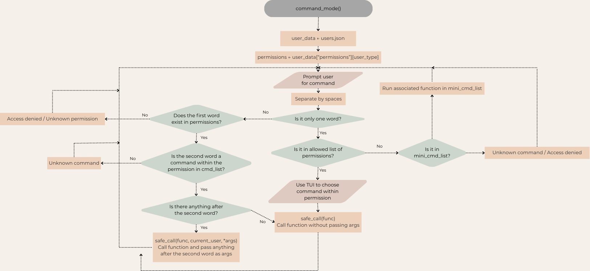

Demystifying each file
======================
This section will fully explain (if not trivial) each file in the project. The subsections represent folders, and the sub-subsections represents the files itself.

logs
----
The logs folder holds .log files than contain user history. Potential debugging, or finding culprits to certain problems. The .log suffix is completely arbitrary and can be parsed or formatted in any way. 

accounts.log
~~~~~~~~~~~~

comments.log
~~~~~~~~~~~~

transactions.log
~~~~~~~~~~~~~~~~

userData
--------
Persistent user data. Any changes made here will be reflected in the system

accounts.json
~~~~~~~~~~~~~
accounts.json contains two main objects, ``permissions`` and ``users``. ``permissions`` is made for configuration by admins.

bookings.json
~~~~~~~~~~~~~

expiry.json
~~~~~~~~~~~
When a user buys or upgrades a membership, their username will be added here as a key, with the value being 30 days after they bought the membership. (In UNIX timestamp)

.. code-block:: json
    :caption: expiry.json
    :linenos:
    
    {
        "member": 1769529726.938576,
        "pcb": 1769526637.2867684
    }

concurrent
----------

delete
~~~~~~

online
~~~~~~

.. _python-file-explanations:

In the project folder itself
----------------------------

banned
~~~~~~

booking.py
~~~~~~~~~~
.. code-block:: python
    :caption: imports for bookings.py
    :linenos:
    
    import json 
    from tui import TUI, timeTUI # local library
    import time 
    from datetime import datetime 
    from utils import * # local library
    from colors import * #local library
    import files
   
    
.. autofunction:: booking.sort_slots

.. code-block:: python
    :lineno-start: 17
    
    bookings = load_json(files.BOOKING_PATH)
    slots = []
    for slot in bookings[trainer]:
        slots.append(bookings[trainer][slot])
    slots.sort(key=lambda x: x["start"]) # sort with regards to start time

    bookings[trainer] = {} # clear slots

    for i in range(len(slots)): 
        bookings[trainer][str(i)] = slots[i] # insert slots back into bookings
    current_user = { "username": trainer, "user_type": "Trainer" } 
    save_json(files.BOOKING_PATH, bookings, current_user) # save changes

.. autofunction:: booking.generate_next_7_days

.. autofunction:: booking.add_slots

.. autofunction:: booking.trainer_editor

.. figure:: images/trainer_editor.png

.. autofunction:: booking.add_slots_epoch

.. autofunction:: booking.attendance

.. autofunction:: booking.venue

.. autofunction:: booking.member_frontend

colors.py
~~~~~~~~~
ANSI color constants. Compatible with all OS!

.. code-block:: python
    :lineno-start: 2
    :caption: Foreground colors
    
    RED = '\033[31m'
    GREEN = '\033[32m'
    YELLOW = '\033[33m'
    BLUE = '\033[34m'
    MAGENTA = '\033[35m'
    CYAN = '\033[36m'
    WHITE = '\033[37m'
    LIGHT_GRAY = '\033[38;5;244m'
    DARK_GRAY = '\033[38;5;240m'
    ORANGE = '\033[38;5;202m'
    GOLD = '\033[38;5;220m'
    PURPLE = '\033[38;5;93m'
    PINK = '\033[38;5;205m'
    BOLD = '\033[1m'
    RESET = '\033[0m'

.. code-block:: python
    :lineno-start: 19
    :caption: Background colors
    
    BG_BLACK = '\033[40m'
    BG_RED = '\033[41m'
    BG_GREEN = '\033[42m'
    BG_YELLOW = '\033[43m'
    BG_BLUE = '\033[44m'
    BG_MAGENTA = '\033[45m'
    BG_CYAN = '\033[46m'
    BG_WHITE = '\033[47m'
    BG_LIGHT_GRAY = '\033[48;5;244m'
    BG_DARK_GRAY = '\033[48;5;240m'
    BG_ORANGE = '\033[48;5;202m'
    BG_GOLD = '\033[48;5;220m'
    BG_PURPLE = '\033[48;5;93m'
    BG_PINK = '\033[48;5;205m'

.. code-block:: python 
    :caption: example usage
    
    from colors import *
    print(RED + "This is red text" + RESET)

main.py
~~~~~~~
This is the file you run, and where users can register, login, and use the CLI to run commands. ``cmdlist`` is to be changed and configured by admins.

.. code-block:: python
    :caption: imports
    :lineno-start: 1

    #internal libraries
    import getpass
    import re
    import time
    import uuid
    import inspect

    #local project libraries
    import commands
    from utils import *

    from tui import TUI
    from colors import *
    import files
    import booking
    import membership
    #globals
    current_user = {}

.. code-block:: python
    :caption: Part of the permission structure
    :lineno-start: 44

    cmdlist = {}    # This is for commands with arguments.
                    # The permission object in accounts.json contains user types, and user types contains the permissions
    cmdlist["manage_staff"] = {
        "delete":   commands.admin_delete_account,
        "add":      commands.admin_add_account,
        "edit":     commands.admin_edit_account,
        "view":     commands.admin_view_account
    }
    cmdlist["manage_members"] = {
        "delete":   commands.fd_delete_account,
        "add":      commands.fd_add_account,
        "edit":     commands.fd_edit_account,
        "topup":    membership.fd_top_up
    }
    ...

.. autofunction:: main.safe_call

.. code-block:: python
    :lineno-start: 35

    try:
        return func(*args, **kwargs)
    except KeyboardInterrupt:
        print("\nReceived keyboard interrupt")
        return None
    except Exception as e:
        print(RED + f"Error: {e}" + RESET) # Will catch TypeErrors, e.g. too many arguments or wrong data types
        return None

.. autofunction:: main.online

.. autofunction:: main.offline

.. autofunction:: main.who

.. autofunction:: main.login

.. figure:: images/login.png

.. autofunction:: main.register

.. autofunction:: main.command_mode

.. autofunction:: main.main

commands.py
~~~~~~~~~~~

.. autofunction:: commands.clear

.. autofunction:: commands.admin_delete_account

.. autofunction:: commands.admin_add_account

.. autofunction:: commands.admin_edit_account

.. autofunction:: commands.fd_delete_account

.. autofunction:: commands.fd_add_account

.. autofunction:: commands.fd_edit_account

.. autofunction:: commands.user_edit_account

.. autofunction:: commands.admin_view_account

.. autofunction:: commands.user_view_account

.. autofunction:: commands.admin_ban_account

.. autofunction:: commands.admin_unban_account

.. autofunction:: commands.direct_messages

.. autofunction:: commands.send_comment

.. autofunction:: commands.view_comments

.. autofunction:: commands.viewlogs

.. autofunction:: commands.text_editor

files.py
~~~~~~~~
Contains cross-os file path constants for each non-python file

.. code-block:: python
    :caption: imports for files.py

    import os

.. autofunction:: files.path

.. code-block:: python
    :lineno-start: 2 

    #File paths, will be relative to this files.py file and is compatible with all os
    
    def path(*args):
        return os.path.join(os.path.dirname(os.path.abspath(__file__)), *args)

Explanation for above

|

Further contents of the file:
        
.. code-block:: python
    :lineno-start: 7

    # examples:
    # FILE_PATH = path("folder1", "folder2", "file")
    # FILE_PATH = path("file")
    
    ACCOUNTS_PATH       = path("userData", "accounts.json")   #userdata/accounts.json
    ACCOUNTS_LOG_PATH   = path("logs", "accounts.log")    #logs/accounts.log
    CHECKIN_LOG_PATH    = path("logs", "checkin.log")      #logs/checkin.log
    MESSAGES_LOG_PATH   = path("logs", "messages.log")    #logs/messages.log
    COMMENTS_LOG_PATH   = path("logs", "comments.log")
    BANNED_PATH         = path("banned") 
    BOOKING_PATH        = path("userData", "booking.json")
    ONLINE_PATH         = path("concurrent", "online")
    DELETE_PATH         = path("concurrent", "delete")
    ATTENDANCE_PATH     = path("logs", "attendance.log")
    TRANSACTION_PATH    = path("logs", "transactions.log")
    EXPIRY_PATH         = path("userData", "expiry.json")
    

kb.py
~~~~~

.. autofunction:: kb.get_key

membership.py
~~~~~~~~~~~~~

.. autofunction:: membership.transaction_history_self

.. autofunction:: membership.transaction_history

.. autofunction:: membership.buy_membership

.. autofunction:: membership.upgrade_membership

.. autofunction:: membership.cancel_membership

.. autofunction:: membership.top_up_balance

.. autofunction:: membership.fd_top_up

.. autofunction:: membership.generate_report

tui.py
~~~~~~

.. autofunction:: tui.clear

.. autofunction:: tui.TUI

.. autofunction:: tui.timeTUI

utils.py
~~~~~~~~

.. autofunction:: utils.find

.. autofunction:: utils.epoch_to_readable

.. autofunction:: utils.conflict

.. autofunction:: utils.write_line

.. autofunction:: utils.load_json

.. autofunction:: utils.save_json
