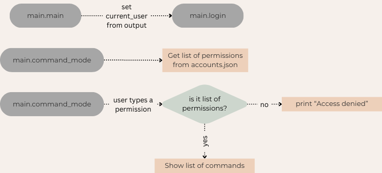
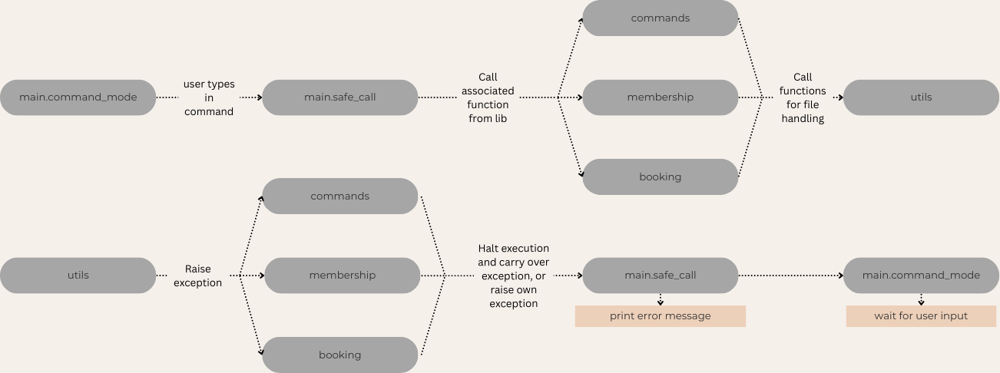

.. _systemdesign:

System design
##############

Permission and command structure
---------------------------------

See: :ref:`config` for more details.

.. _error_flow:

Data, file handling, and error handling flow
---------------------------------------------

No matter how many nested function calls there are, if one of them raises an exception, it will halt the functions it was being abstracted by; until it reaches one with a try-catch.

.. _multi_instance:

Multi-instance 
--------------
When an admin bans or deletes a user while they are still online, the script will promptly exit their session. 

Firstly, the script will write the current user's username in ``online``. This file should be empty when no one is using the program.

Secondly, when an admin deletes a user, ``commands.admin_delete_account`` will check if the user is in ``online`` first. Banning will simply write to ``banned``.

.. code-block:: python
    :caption: commands.admin_delete_account 
    :lineno-start: 53
    
    
    if find(delete_user, files.ONLINE_PATH): # if user is online, add to delete list
        write_line(delete_user, files.DELETE_PATH)

They are caught in two ways:

- Between entering a command and calling the function

.. code-block:: python 
    :caption: main.command_mode
    :lineno-start: 349
    
    if find(current_user["username"], files.BANNED_PATH):
        print(RED + f"Your account has been banned, please contact an admin to restate your account" + RESET)
        offline()
        time.sleep(1)
        exit(0)

    with open(files.DELETE_PATH, "r") as delete_file:
        deleted_users = delete_file.read().splitlines()

        if current_user["username"] in deleted_users:
            print(RED + f"Your account has been deleted, please contact an admin to restate your account" + RESET)
            offline()
            deleted_users.remove(current_user["username"])

            with open(files.DELETE_PATH, "w") as f:
                f.write("\n".join(deleted_users))

            time.sleep(1)
            exit(0)

- Right before modifiying a file

.. code-block:: python 
    :caption: utils.save_json
    :lineno-start: 99
    :emphasize-lines: 13-16
    
    def save_json(filepath, data, current_user): # generic json saver
        """
        Saves data to json file 
    
        :param str filepath: The file path
        :param dict data: The data to save
        :param dict current_user: The current user
        :raises PermissionError: if the user is banned or deleted
        :raises Exception: if an error occurs
        """
        username = current_user["username"]
        
        if find(username, files.BANNED_PATH):
            raise PermissionError("You are banned")
        if find(username, files.DELETE_PATH):
            raise PermissionError("Your account has been deleted")
        
        try:
            with open(filepath, "w") as f:
                json.dump(data, f, indent=4)
        except Exception as e:
            raise Exception(f"Error saving to {filepath}: {e}")

    

    