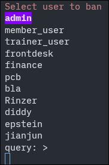
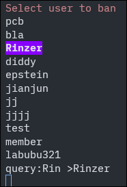
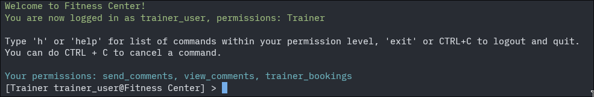
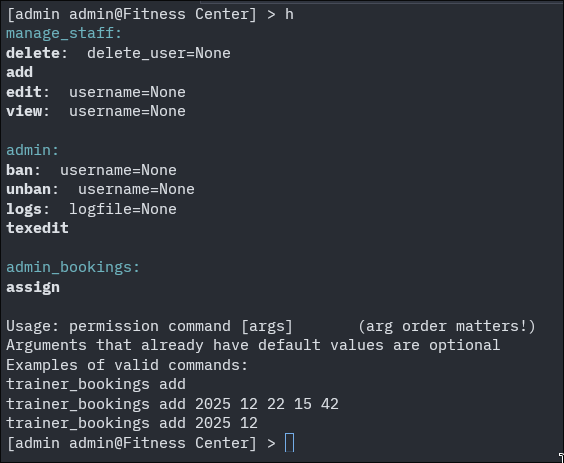
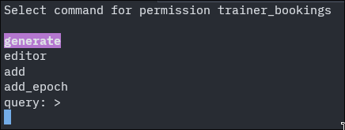
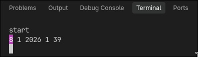
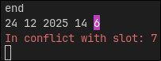
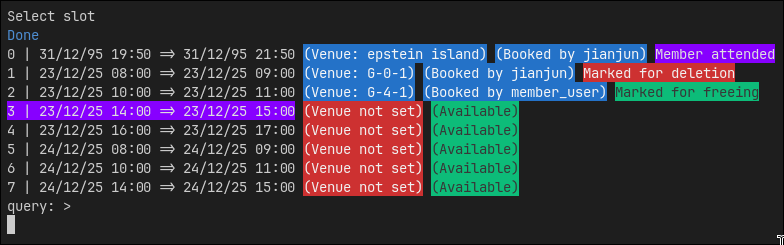
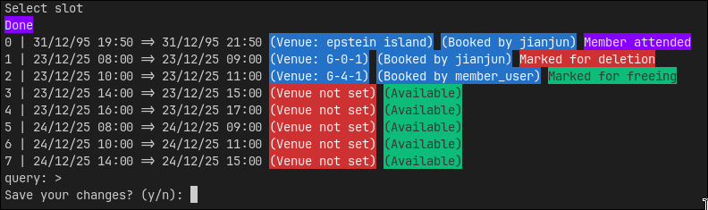

Usage
#####

Installation 
************
.. code-block:: bash

    git clone https://github.com/pcb1631/PYP
    
Or download the zip file and extract it TO ONE FOLDER AS-IS.

Running the project
*******************
**IDEs will always have issues with input and rendering, so it is reccomended that you use a dedicated terminal like CMD/Powershell or Ghostty.**

.. code-block:: bash

    python main.py
    
OR
    
.. code-block:: bash

    python ./PYP/main.py #the directory of the project
    
Or double click main.py on Windows. Some functionalities are only on Linux but WSL is an option.

But in real world use, it is assumed that the script is in a full screen terminal preventing the user from stopping the script, with whatever means necessary

For example:

In a Linux distro, run this script at startup in a TTY without a display manager. This way it is gurranteed the user never exits the script.

.. code-block:: bash
    
    #!/bin/bash
    
    trap '' SIGINT #ignore CTRL + C interrupt
    
    while true; do
        python main.py
    done

TUI
****
The TUI will be the first thing you encounter in the project.

The first line is the prompt, the lines in the middle are the options, and the last line is fuzzy search. Your selection is the highlighted option

    TUI brought up with the command ``admin ban``
    
|
    
Typing will make a query, and uses fuzzy search to change your selection to the closest match.

    
    Typing ``Rin`` autocompletes to ``Rinzer``
    
|
    
Press arrow keys to change selection and enter to confirm. If the options out number the size of your terminal, the TUI will scroll the options!

Press CTRL+C to cancel at any point

Register
*********
.. explain about registration

Login
******
.. prentend we're logging in as a trainer

CLI
****
Once you're logged in, you'll be met with the following:

if you have an active membership, it will show how many days you have left!

    
    typing ``h`` in the CLI
    
|

The blue words are your permissions, the bold words are the commands under that permission, and stuff after the colon are arguments. If an argument has a value assigned, that is the default value.

But you can go ahead and skip the CLI altoghether by typing a permission, or ``tui`` to bring up the TUI.

    
    The TUI after typing the permission ``trainer_bookings``
    

|

.. _timeTUI:

timeTUI
*******
If you're adding slots or making a finance report, you will encounter the timeTUI.

Initially, you'll see a date in the format of DD MM YYYY HH MM

You can choose each field by using left and right arrow keys, then increase or decrease that field with up and down arrow keys. 

    The timeTUI after typing the permission ``trainer_bookings``

|

The timeTUI will consider leap years and months with different number of days. 

It will also alert you if the time you picked is in conflict with an existing slot.

    Current time in between time range of slot 7

|

.. code-block:: json
    :caption: slot 7 of current user in bookings.json, with start time being 24/12/2024 14:00
    :lineno-start: 82
    :emphasize-lines: 2,3

    "7": {
        "start": 1766556000,
        "end": 1766559600,
        "bookedBy": null,
        "venue": null,
        "Attended": false
    }

Finally, press enter to confirm.

|

The booking system
*******************
Heavily inspired by iConsult in APSpace, trainers can make time slots for users to book. 

As a Trainer
============
You can simply run ``trainer_bookings`` to bring up the TUI and view all the available commands 

|

Adding time slots
------------------

To manually add time slots to your booking,

.. code-block:: bash

    trainer_bookings add_slots

In this command, you will encounter :ref:`timeTUI`.

|

.. _editor:

Editing and signing attendance
------------------------------

.. code-block:: bash 

   trainer_bookings editor

In the editor, the TUI will be used a little differently. 

When you select a slot, you can mark it for attendance, free it up, delete it, or leave it untouched. Pressing enter will not exit the TUI, but will cycle between these 4. 

Technically pressing enter exits the TUI, but it's in a while loop, and your selected option won't be reset to the first one because it remembers your selection.

    slot 0 selected once, slot 1 selected twice, slot 2 selected thrice, slot 3 selected four times

|

Select "Done" to apply your changes.

    The prompt after selecting "Done"

|

Generating slots
----------------
If you have decided that the process of adding timeslots is too cumbersome, there is a dedicated command to generate 4 slots for 7 days each.

.. code-block:: bash

    trainer_bookings generate

This command will generate an 8AM, 10AM, 2PM, and 4PM slot that last for an hour each day.

|

As a Member
===========

Booking time slots
------------------
Will be similar to :ref:`editor`, but you can only book time slots

|

As an Admin
===========

Assigning venues to timeslots
-----------------------------
Will be similar to :ref:`editor`, but you'll need to type in a venue every time you select a slot

|

As Frontdesk
============

Signing attendance
------------------
Will be similar to :ref:`editor`, but you can only sign attendance

|

The membership system
**********************

As a Member
============

Topping up your balance
-----------------------

.. code-block:: bash

    membership top_up_balance

|

Buying membership
-----------------

.. code-block:: bash

    membership buy

You won't be able to use this command if you already have a membership

|

Upgrading your membership
---------------------------

.. code-block:: bash

    membership upgrade

You won't be able to use this command if you don't have a membership or if you already have a Premium membership

|

Canceling your membership
-------------------------

.. code-block:: bash

    membership cancel

No refunds!

|

Viewing your transaction history
--------------------------------

.. code-block:: bash

    my_transactions view

|

